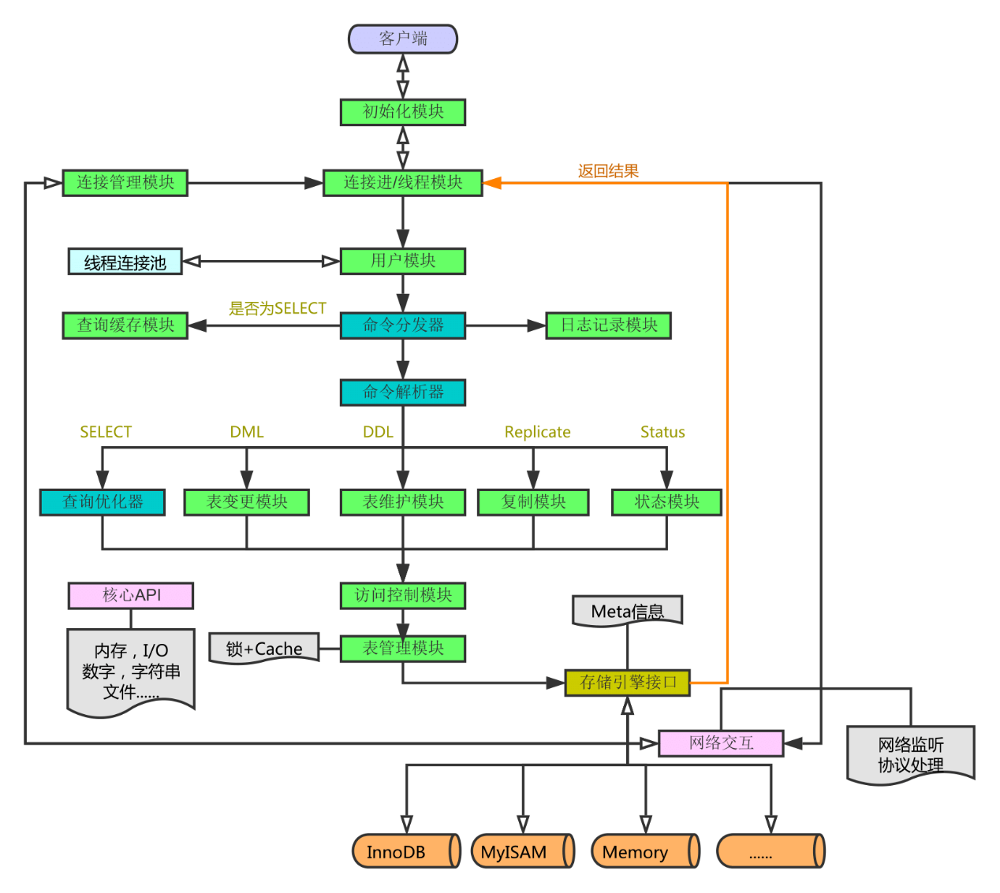

# MySQL 架构

## 查询执行流程

### 连接
- 客户端发起一条Query请求，监听客户端的‘连接管理模块’接收请求
- 将请求转发到‘连接进/线程模块’
- 调用‘用户模块’来进行授权检查
- 通过检查后，‘连接进/线程模块’从‘线程连接池’中取出空闲的被缓存的连接线程和客户端请求对接，如果失败则创建一个新的连接请求

### 处理
- 先查询缓存，检查 Query 语句是否完全匹配， 
- 查询缓存失败则转交给‘命令解析器’ 
- 再转交给对应的模块处理
- 如果是SELECT查询还会经由‘查询优化器’做大量的优化，生成执行计划
- 模块收到请求后，通过‘访问控制模块’检查所连接的用户是否有访问目标表和目标字段的权限
- 有则调用‘表管理模块’，先是查看 table cache 中是否存在，有则直接对应的表和获取锁，否则重新打开表文件
- 根据表的 meta 数据，获取表的存储引擎类型等信息，通过接口调用对应的存储引擎处理
- 述过程中产生数据变化的时候，若打开日志功能，则会记录到相应二进制日志文件中

### 结果

- Query请求完成后，将结果集返回给‘连接进/线程模块’
- 返回的也可以是相应的状态标识，如成功或失败等
- ‘连接进/线程模块’进行后续的清理工作，并继续等待请求或断开与客户端的连接