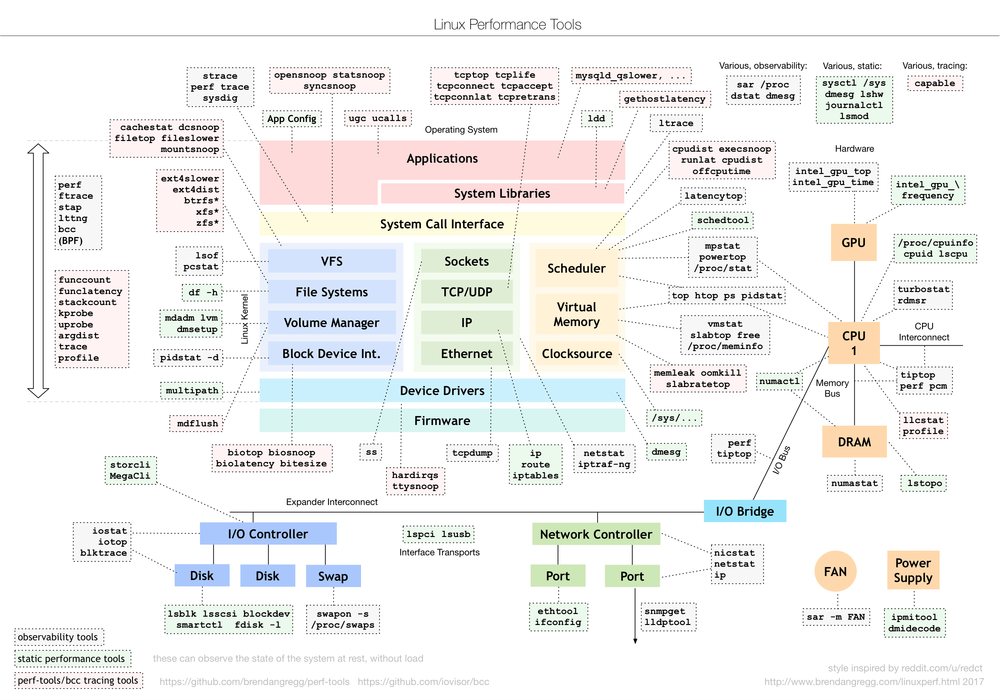

Linux 性能问题通常不是靠单个命令定位。应先确认业务症状和时间范围，再从 CPU、内存、磁盘、网络和进程逐层缩小范围。



## USE 方法

对每一类资源检查三个维度：

- **Utilization：** 资源在多大比例的时间内处于忙碌状态。
- **Saturation：** 是否出现排队，等待工作的数量有多少。
- **Errors：** 是否存在硬件、内核或应用错误。

高利用率不一定是问题，排队也不一定来自对应资源。需要把系统指标与请求延迟、吞吐和错误率放到同一时间线分析。

## 常用工具

| 目标 | 首选工具 | 重点观察 |
| --- | --- | --- |
| 整体负载 | `uptime` | 1、5、15 分钟平均负载趋势 |
| CPU | `mpstat`、`top` | 各 CPU 使用率、iowait、steal |
| 进程 | `pidstat` | 进程 CPU、内存、I/O、上下文切换 |
| 内存 | `vmstat`、`free` | 可用内存、换页、运行和阻塞队列 |
| 磁盘 | `iostat` | 吞吐、延迟、队列和设备利用率 |
| 内核热点 | `perf` | 调用栈、CPU 周期、缓存未命中 |

## 使用 perf 定位 CPU 热点

先观察整体硬件计数器：

```bash
sudo perf stat -p <pid> -- sleep 10
```

再采样调用栈：

```bash
sudo perf record -F 99 -g -p <pid> -- sleep 30
sudo perf report
```

采样会增加额外开销。生产环境应限制时间和频率，并确认内核的 `perf_event_paranoid` 与符号文件配置符合安全要求。
