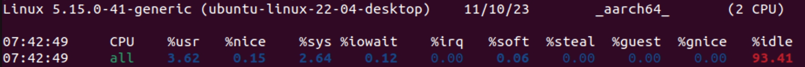

mpstat 是一个多核 CPU 性能分析工具，用来实时查看每个 CPU 的性能指标，以及所有 CPU 的平均指标。

它需要在 Linux 系统上安装 sysstat。sysstat 包含了很多工具，用于监控和分析 Linux 系统性能。在使用之前需要安装对应的包。

```bash
apt install sysstat
```

安装完成后，执行一下对应的命令。

```bash
mpstat
```



这里只能看到全部 CPU 指标数据，没法看到每个对应的 CPU 状态。添加参数即可。

```bash
# -P ALL 表示监控所有的 CPU
# 数字 3 表示每隔 3 s 输出一组数据
# 后面还可以加一个数字表示采样次数，不加则循环采集
mpstat -P ALL 3
```


我们看一下对应的参数含义：

|   参数   | 描述  |
|  ---------  | --------- |
| CPU  | 单个 CPU,还是全部 CPU |
| %usr  | internal 时间段里，用户态的 CPU 时间(%) |
| %nice  | internal 时间段里，“友好”进程的 CPU 时间(%) |
| %sys | internal 时间段里，内核的 CPU 时间(%) |
| $iowait | internal 时间段里，硬盘 IO 等待时间(%) |
| %irq | internal 时间段里，处理硬中断所占用的 CPU 时间(%) | 
| %soft | internal 时间段里，处理软中断所占用的 CPU 时间(%) |
| %idle | CPU 除去等待磁盘 IO 操作外的因为任何原因而空闲的时间闲置时间(%) |


此外  %steal，%guest，%gnice 三个参数和使用虚拟机相关。

根据上述指标可以看到 CPU 处于空闲状态。当然了，作为学习，开发者可以监控时候实时使用软件，这样你就可以观测不同软件会对 CPU 有什么样的影响。会加深你对工具的理解。

注：以上所有操作均在虚拟机 Ubuntu 22.04 GUI 系统。