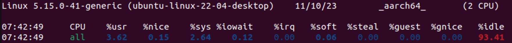
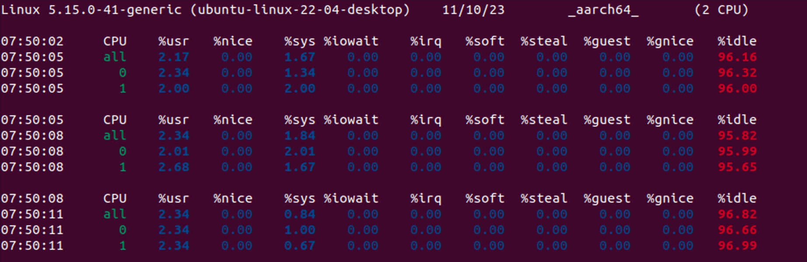

`mpstat` 来自 `sysstat` 软件包，可以同时查看全部 CPU 的平均值和每个逻辑 CPU 的使用情况。

```bash
sudo apt install sysstat
mpstat -P ALL 1 5
```

`-P ALL` 显示所有逻辑 CPU，`1 5` 表示每秒采样一次，共五次。判断实时问题时应关注后续区间数据，而不是只看自启动以来的平均值。





## 指标含义

| 指标 | 含义 |
| --- | --- |
| `%usr` | 普通用户态代码使用的 CPU 时间 |
| `%nice` | 调整过 nice 值的用户态进程时间 |
| `%sys` | 内核态代码使用的 CPU 时间 |
| `%iowait` | CPU 空闲且系统存在未完成 I/O 的时间 |
| `%irq` | 处理硬中断的时间 |
| `%soft` | 处理软中断的时间 |
| `%steal` | 虚拟 CPU 等待宿主机调度的时间 |
| `%idle` | 其余空闲时间 |

## 判断思路

- 所有 CPU 的 `%usr` 都很高，通常是计算密集型负载。
- 单个 CPU 长期繁忙而其他 CPU 空闲，可能是单线程热点、CPU 亲和性或中断分布问题。
- `%sys` 或 `%soft` 较高时，应继续检查系统调用、网络包处理和中断。
- `%iowait` 较高时结合 `iostat`，不要直接把它解释为 CPU 本身性能不足。
- 虚拟机中 `%steal` 较高，说明宿主机资源竞争可能影响当前实例。

再使用 `pidstat -u`、`top -H` 或 `perf` 把系统级异常定位到进程、线程和调用栈。
