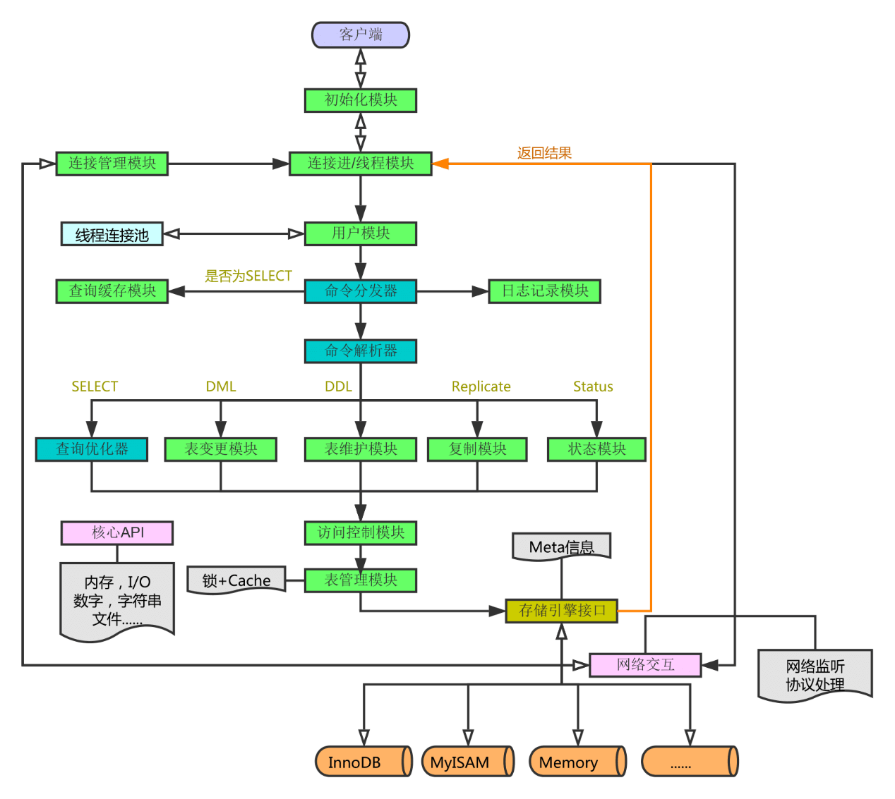

MySQL 采用客户端/服务端架构。服务端负责连接、权限、SQL 解析与优化，再通过统一接口调用 InnoDB 等存储引擎完成数据访问。

示意图可能包含旧版 Query Cache。MySQL 8.0 已移除查询缓存，现代系统不应再围绕它设计优化方案。

## 连接与权限

1. 客户端通过 TCP 或 Unix Socket 建立连接。
2. 服务端完成身份认证，并为会话保存字符集、事务隔离级别和 SQL Mode 等状态。
3. 执行语句时检查账号对数据库、表、列或存储程序的权限。

每个连接都会占用服务端资源。应用应使用大小受控的连接池，并让数据库连接上限、线程数和下游容量匹配。

## SQL 处理层

一条查询通常经过以下阶段：

1. **解析：** 检查语法并构建内部语法结构。
2. **预处理：** 解析表和列，检查语义与权限。
3. **优化：** 根据统计信息估算不同访问路径、连接顺序和索引的成本。
4. **执行：** 调用存储引擎接口读取记录，并完成过滤、连接、排序或聚合。
5. **返回：** 按协议把列定义、数据行或错误发送给客户端。

执行计划是基于统计信息的成本选择，不是永久绑定。数据分布、索引、参数和 MySQL 版本变化后，优化器可能选择不同计划。

## InnoDB 存储层

InnoDB 负责聚簇索引、二级索引、事务、锁和崩溃恢复。常见组件包括：

- **Buffer Pool：** 缓存数据页和索引页，减少磁盘读取。
- **Redo Log：** 记录页级变化，保证已提交事务可以在崩溃后恢复。
- **Undo Log：** 支持事务回滚和 MVCC 一致性读。
- **Change Buffer、Doublewrite 等机制：** 降低部分随机写成本并保护页写入完整性。

## 写入与日志

更新数据时，InnoDB 修改 Buffer Pool 中的页并写入 redo；MySQL Server 层根据配置记录 binlog。事务提交需要协调 redo 与 binlog，确保崩溃恢复和复制看到一致的事务状态。

分析性能问题时应先确认瓶颈位于连接、SQL 执行、锁等待、Buffer Pool、日志刷盘还是底层存储，而不是把所有慢查询都归因于“没有索引”。
