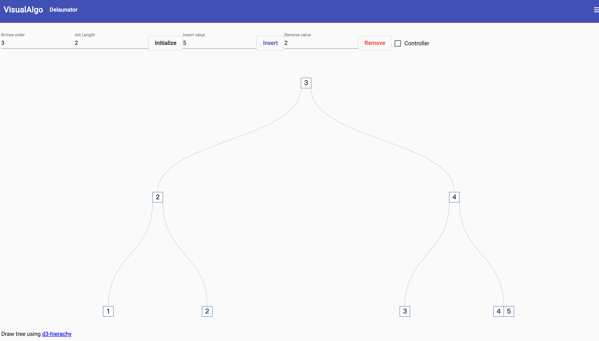

InnoDB 使用 B+ 树组织聚簇索引和二级索引。节点对应固定大小的页，叶子节点保存有序记录，上层节点保存键范围和子页指针。

## 插入与页分裂

目标叶子页有足够空间时，新记录会按键顺序插入。页面空间不足时，InnoDB 需要分配新页并重新分布记录，再把新页的边界键写入父节点。父节点也可能继续分裂；根节点分裂时，树高增加一层。

自增主键通常写入 B+ 树右侧，能减少随机位置的页分裂和碎片，但高并发时也可能形成末端页写入热点。随机主键会让写入分散，却通常带来更多页分裂、更低的页填充率和更大的索引。

## 删除与页合并

删除记录后，页不会因为少量空闲空间立即消失。随着记录持续删除，InnoDB 可以重新组织页面，并在满足条件时合并相邻页。大量删除可能留下碎片，是否需要重建表应根据实际空间回收需求和查询表现判断。

## 为什么树高通常较低

一个索引页可以保存大量键和子页指针，因此 B+ 树的扇出很高。即使数据量很大，树高通常也只有几层，查找复杂度约为 `O(log_m N)`，其中 `m` 是每个节点的扇出。

上层索引页访问频繁，通常更容易留在 Buffer Pool 中，但这是一种缓存结果，不是“必然常驻内存”的保证。性能仍取决于索引宽度、缓存命中率、数据分布和存储延迟。

可以通过 [B+ tree visualization](https://visual-algo.firebaseapp.com/) 观察插入、分裂和合并过程。

仓库 [b-plus-tree](https://github.com/wsafight/b-plus-tree) 提供了一个用于学习的数据结构实现。它可以帮助理解算法，但不能代表 InnoDB 的页格式、并发控制和恢复机制。
