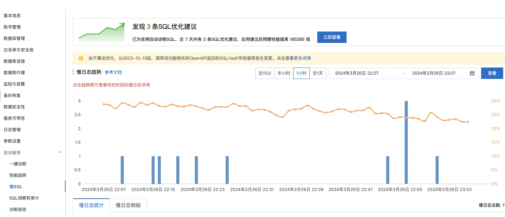

在优化 MySQL 时，通常需要对数据库进行分析。分析慢查询日志是一个非常重要的手段。

## 开启慢查询日志

在配置文件 my.cnf 或 my.ini 中在 [mysqld] 一行下面加入两个配置参数：

log-slow-queries=/data/mysqldata/slow-query.log

long_query_time=5

注：log-slow-queries 参数为慢查询日志存放的位置，一般这个目录要有 MySQL 的运行帐号的可写权限，一般都将这个目录设置为 MySQL 的数据存放目录。

long_query_time=5 中的 5 表示查询超过五秒才记录。

还可以在 my.cnf 或者 my.ini 中添加 log-queries-not-using-indexes 参数，表示记录下没有使用索引的查询。

## 慢查询日志分析

我们可以通过打开 log 文件查看得知哪些 SQL 语句执行效率低下。  
从日志中，可以发现查询时间超过 5 秒的 SQL，而小于 5 秒的语句没有出现在此日志中。

如果慢查询日志中记录内容很多，可以使用 mysqldumpslow 工具（MySQL 客户端安装自带）来对慢查询日志进行分类汇总。

```SQL
-- 记录次数最多的 10 条SQL语句
mysqldumpslow -s c -t 10 /database/mysql/slow-query.log

-- 返回记录集最多 10 个查询语句
mysqldumpslow -s r -t 10 /database/mysql/slow-query.log

-- 按照时间排序的前10条里面含有左连接的查询语句
mysqldumpslow -s t -t 10 -g "left join" 10 /database/mysql/slow-query.log

```

-s, 是表示按照何种方式排序，c、t、l、r 分别是按照记录次数、时间、查询时间、返回的记录数来排序，ac、at、al、ar，表示相应的倒叙。

-t, 是 top n 的意思，即为返回前面多少条的数据。

-g, 后边可以写一个正则匹配模式，大小写不敏感的。

使用 mysqldumpslow 命令可以非常明确的得到各种我们需要的查询语句，对 MySQL 查询语句的监控、分析、优化是 MySQL 优化非常重要的一步。开启慢查询日志后，由于日志记录操作，在一定程度上会占用 CPU 资源影响 mysql 的性能，但是可以阶段性开启来定位性能瓶颈。

## 云数据库

如果是云数据库的话，可以直接进行分析：


