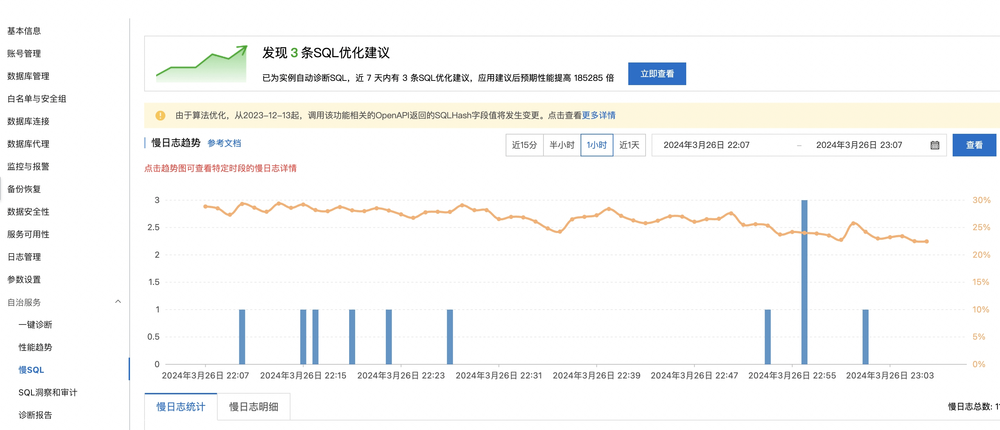

慢查询日志记录执行时间超过阈值的语句，是定位数据库性能问题的重要证据。分析时既要看最慢的单次查询，也要看高频查询的累计时间。

## 配置日志

在 MySQL 配置文件中设置：

```ini
[mysqld]
slow_query_log = ON
slow_query_log_file = /var/log/mysql/mysql-slow.log
long_query_time = 1
min_examined_row_limit = 100
log_output = FILE
```

`long_query_time` 支持小数秒。日志目录必须由 MySQL 运行账号写入，并应配置轮转、权限和磁盘告警。

也可以动态调整全局变量：

```sql
SET GLOBAL slow_query_log = ON;
SET GLOBAL long_query_time = 1;
```

全局 `long_query_time` 通常只影响之后建立的会话。需要重启后保留时，使用配置文件或在目标版本支持的情况下使用 `SET PERSIST`。

`log_queries_not_using_indexes` 可能记录大量本来就适合全表扫描的小查询。启用前配合 `min_examined_row_limit`，并监控日志增长。

## 使用 mysqldumpslow

```bash
# 执行次数最多的 10 类查询
mysqldumpslow -s c -t 10 /var/log/mysql/mysql-slow.log

# 平均查询时间最高的 10 类查询
mysqldumpslow -s at -t 10 /var/log/mysql/mysql-slow.log

# 只看包含 left join 的查询
mysqldumpslow -s t -t 10 -g 'left join' /var/log/mysql/mysql-slow.log
```

`mysqldumpslow` 会把字面量抽象后聚类。更复杂的分位数、时间分布和样例分析可以使用 Percona Toolkit 的 `pt-query-digest`。

## 分析流程

1. 按总耗时、频率、平均/最大耗时和扫描行数排序。
2. 取真实参数，在安全环境查看 `EXPLAIN ANALYZE`。
3. 对照业务请求、锁等待、CPU、I/O 和 Buffer Pool 指标。
4. 优化后继续采样，确认累计成本和尾延迟都下降。

云数据库通常提供慢 SQL 聚合页面，但仍要确认采样范围、归一化规则和保留周期。


